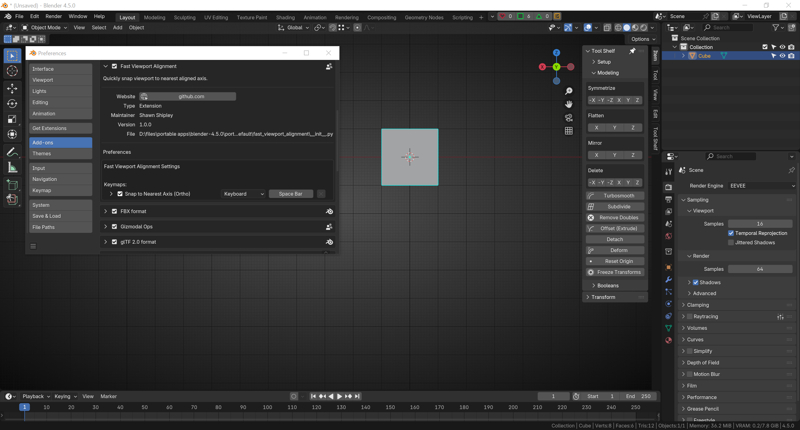
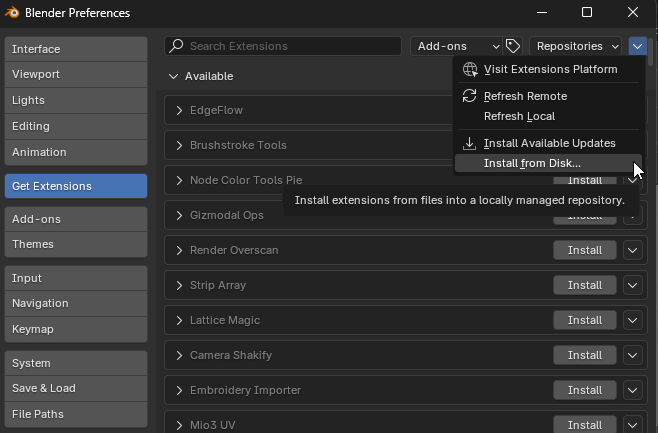

# Fast Viewport Alignment

Fast Viewport Alignment is a lightweight and simple add-on that quickly snaps your viewport to the nearest orthographic axis view with a single shortcut.

## Feature Description
Instantly snap your 3D viewport to the nearest orthographic axis view with a single keypress. Instead of manually selecting the orthographic view you want, just press your preferred shortcut key to instantly snap to which ever axis you are most closely aligned to. The default assigned shortcut is `Alt + Spacebar`.

## Note
While the default assigned shortcut is `Alt + Spacebar`, if your workflow allows it, assigning only the `Spacebar` as your shortcut is the most ergonomic and complimentary way to use the add-on.

## Screenshot

Figure 1 - There are no N-panel options to dig through. Just set your prefered shortcut key under the add-on's preferences and you're done.

## Video

Figure 2 - As you orbit around your object, just press your shortcut key to snap to the nearest aligned axis. Orthographic view will be enalbed. As soon as you orbit again, you'll return to perspective mode.

## Supported Blender Versions
Supports Blender versions 4.2+

## Installation Options

### Blender Extensions Platform

Coming soon...

### Install from Disk

Fast Viewport Alignment can also be installed manually, which you can download from the [Releases](https://github.com/shawnshipley/fast-viewport-alignment/releases) section of its [Github](https://github.com/shawnshipley/fast-viewport-alignment) page. Just follow the steps below to install:
1. Download the latest [release](https://github.com/shawnshipley/fast-viewport-alignment/releases)
2. In Blender, go to Edit -> Preferences
3. Click on `Get Extensions`
4. Click the Extensions Settings drop-down arrow (the small arrow in the upper right corner of the window that's facing down) and select `Install from Disk`.

5. Browse to the downloaded .zip file and select it to complete the installation.

Fast Viewport Alignment will now show up in your installed add-ons and you can set your shortcut key.

### Changelog

#### 8/6/25 (v1.0.0)
- Initial release to Blender Extensions platform.
